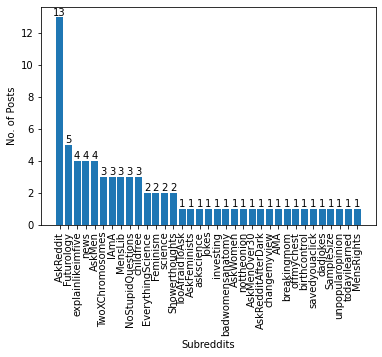
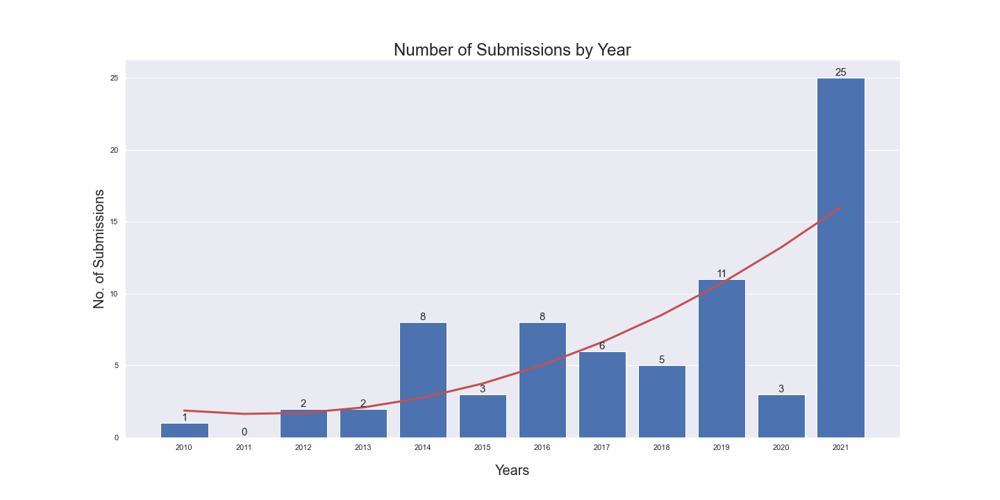
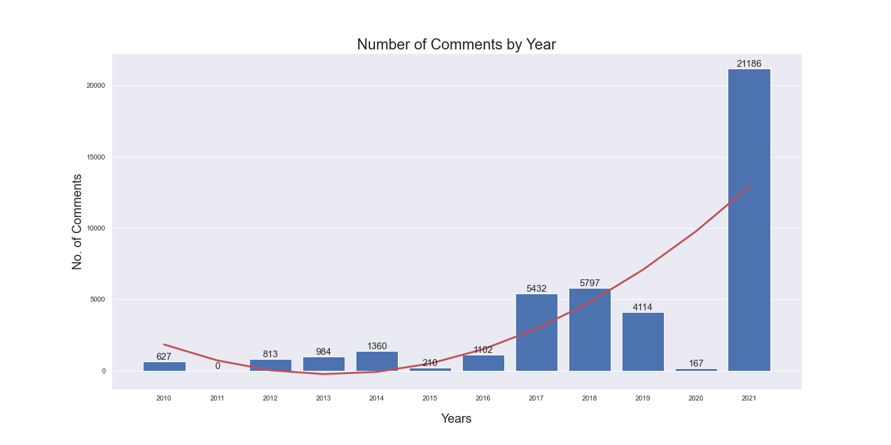
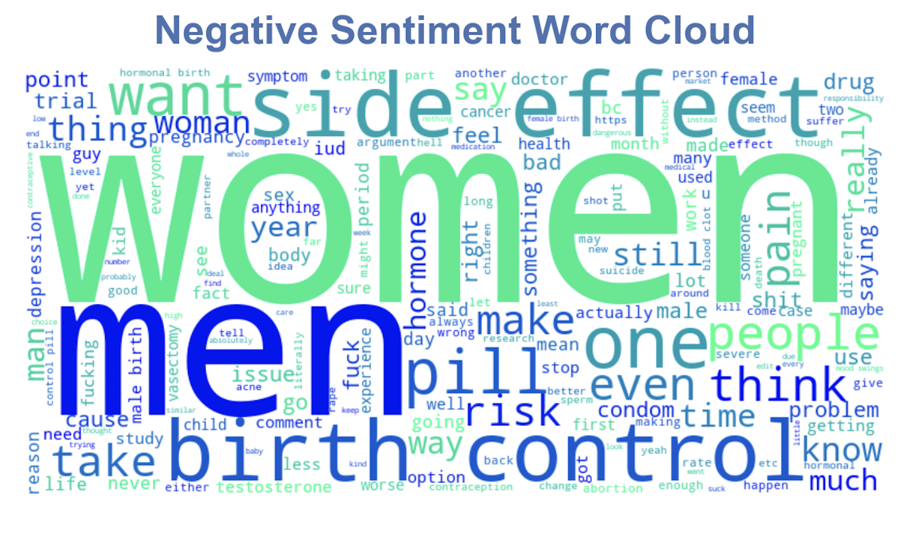
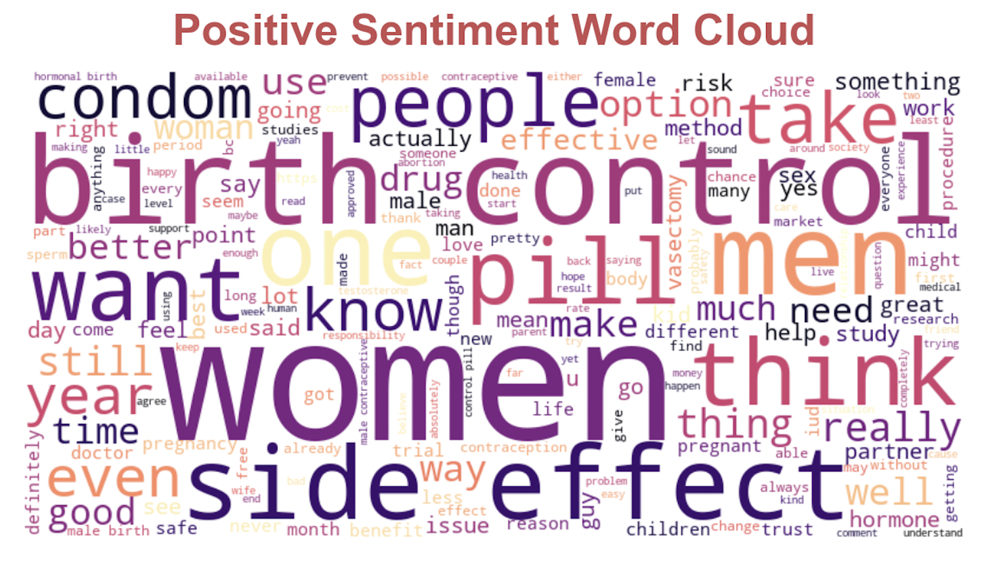
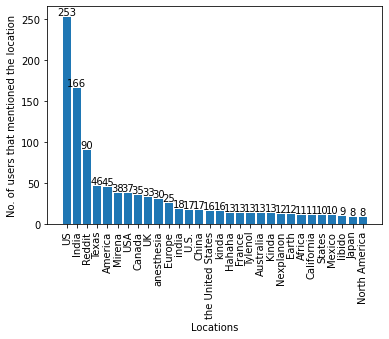
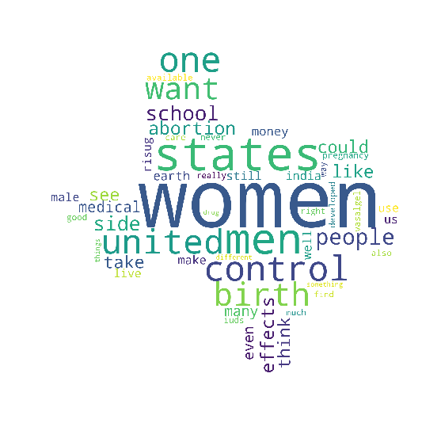
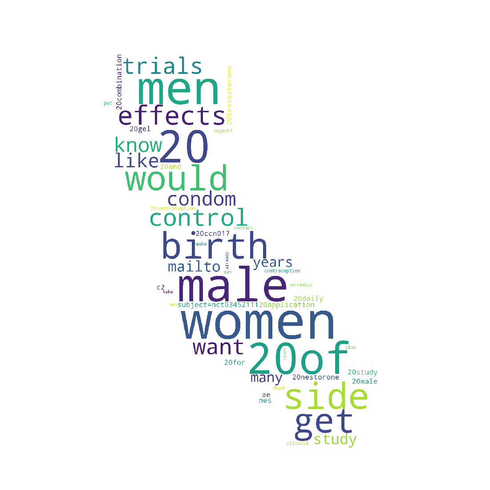
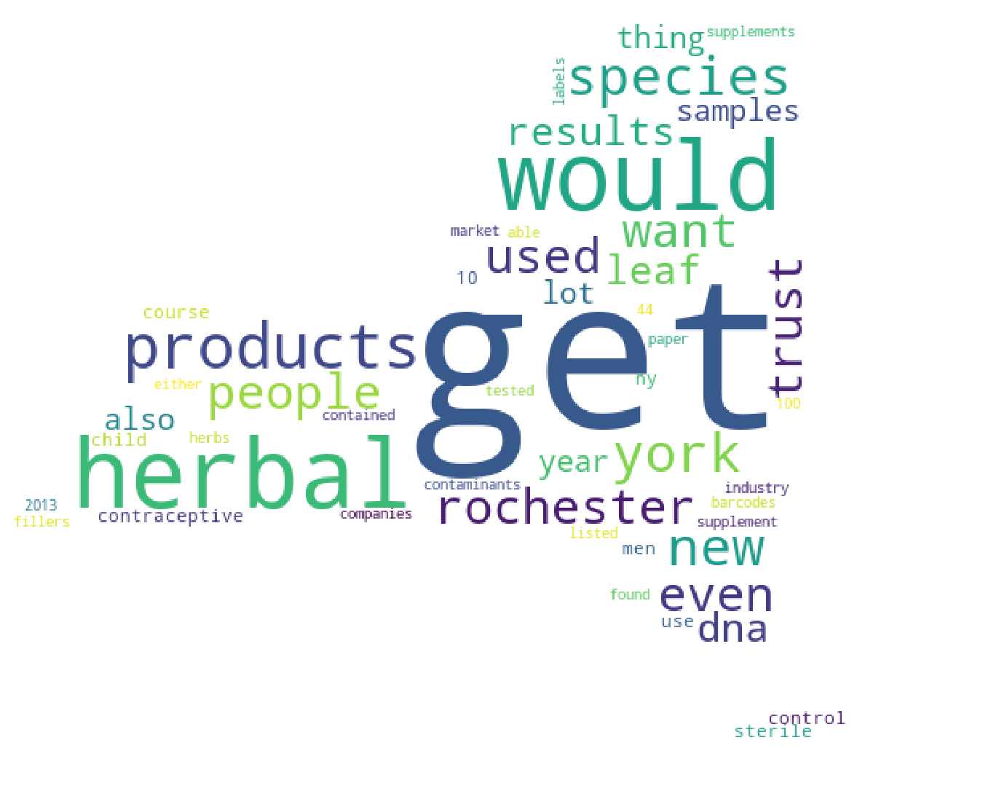
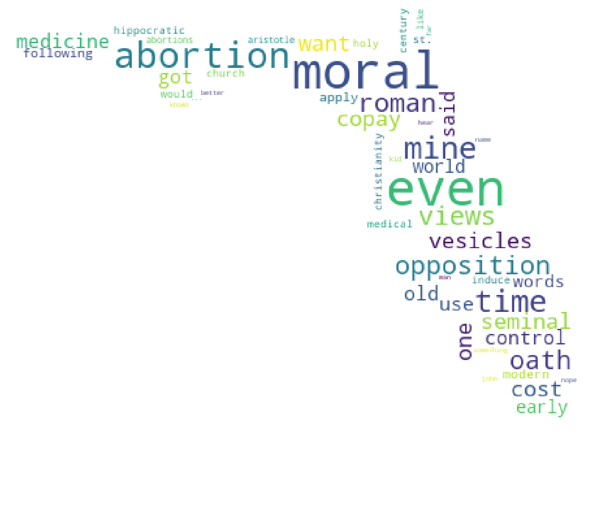

## Motivation

<!-- Novel, or hypothesized medical treatments, such as COVID-19 vaccines and male contraception, are regularly discussed on social media. For example, on the AskReddit subreddit, questions of the form “”Would you take [x] if it existed?”” Aside from willingness to use these novel treatments, the answers to these questions contain important clues to peoples' latent concerns and barriers to adoption of novel medications. Understanding them can provide crucial information about how to introduce, communicate, and counsel about new medications when they come to market.  -->

- Novel medical treatments are regularly discussed in social media
- Analyzing this data will help us understand:
  - Concerns about the treatment
  - Barriers to adoption
  - Evolution of concerns over time
- This information will help us to:
  - Learn how to communicate about novel treatments
  - Understand how to address concerns
  - Counsel patients about novel treatment options


## Data

**Source of Data:**
- The data was collected by searching for relevant queries such as `male birth control` on Google, with the filter `site:reddit.com`.
- Around **74** posts over **12** years were identified, and the data was exported using [PRAW](https://praw.readthedocs.io/en/stable/_).
- The data consists of the submissions with the comments in it. Also, the user history of the commenters was downloaded.

**Data files**

- submissions : 74 posts (in .pkl files)
- users: 21627 user history of those who commented on the submissions (in .pkl files)
- Out of 41,792 comments read, 5179 comments had deleted user information. 
- 22,099 unique users were found from all submissions.


## Problem

We set out to answer the following questions:
- What years were users most engaged in the topic of male contraception?
- What general topics can we identify in the discussions on Reddit?
- What are the sentiments of the users when they write about male contraception?
- Are there users who engaged with the topic of male birth control over multiple years?
- Has their sentiment shifted or remained the same over the years?
- Do users mention specific locations?
- What is the context around which users mention a location?


## Methods

We attempted to answer these questions through the following methods:

- Creating a histogram of users commenting on multiple posts (Jae)
  -	Represent the frequency of usernames present in multiple Reddit submissions.
    <details>
      <summary><u style="color:blue">Click to expand for more details on histogram</u></summary>
      <h4>Histogram of users commenting in multiple Reddit submissions.</h4>
      <p>
        Using matplotlib to represent the frequency of usernames present in multiple Reddit submissions.
      </p>
      <ul>
      <li> Created a list of usernames found in the comment section of each submission. </li>
      <li> Usernames with multiple comments were included only once, and deleted usernames were excluded.</li>
      <li> From the list of unique usernames for all Reddit submissions, the frequency of each username presents in all submissions were calculated. </li>
      <li> Using matplotlib, a histogram was plotted to represent the frequency of usernames commenting in multiple Reddit submissions. </li>
      </ul>
    </details>
  
- Sentiment analysis through the years (Jae)
  -	Calculate the overall sentiment of each Reddit submission.
  - Depict words most occur in each negative and positive sentiment.
  -	Visualize sentiment scores for all Reddit submissions to represent sentiment trend.
    <details>
      <summary><u style="color:blue">Click to expand for more details on histogram and sentiment analysis</u></summary>
      <p>
      <h4>Sentiment Analysis</h4>
      <p>
      Using <a href="https://github.com/cjhutto/vaderSentiment">VADER sentiment analysis</a>, the overall sentiment of each Reddit submissions was calculated by analyzing all comments within the submission. 
      </p>
      <ul>
      <li> Performed sentiment analysis of all comments in each Reddit submission by using (Valence Aware Dictionary and sEntiment Reasoner) VADER. </li>
      <li> A list was created to store the positive, negative, neutral and compound sentiment score for all comments of the Reddit submission.</li>
      <li> Comments with a compound sentiment scores greater than or equal to 0.05 was considered as positive sentiments, and compound sentiment scores less than or equal to -0.05 was considered as negative sentiments. Neutral sentiment ranged a compound sentiment scores between -0.05 and 0.05.</li>
      </ul>
      <h4>Word Cloud</h4>
      <p>
      Using WordCloud, comments with negative and positive sentiments were selected to create a word cloud to depicts words most found in each respective sentiment. 
      </p>
      <ul>
      <li> Lists of comments with negative and positive sentiment were created, selecting comments with compound sentiment scores less than -0.9 and greater than 0.9 for their respective lists. </li>
      <li> All comments from both negative sentiments and positive sentiments were normalized by removing special characters, numbers and stopwords using (Natural Language Toolkit) NLTK. </li>
      <li> The resulting positive sentiment list of words and negative sentiment list of words were used to create their respective word cloud, using WordCloud. </li>
      </ul>
      <h4>Sentiment score Boxplot of all Reddit Submission</h4>
      <p>
      Using seaborn, boxplots of sentiment scores for all Reddit submissions was created using boxplot, stripplot, and pointplot, to represent all data points and a line graph of all means. A trendline using all means was also included in the figure. 
      </p>
      <ul>
      <li> The lists of compound sentiment scores of all Reddit submissions were organized in chronological order.</li>
      <li> Seaborn was used to create a graphical representation of the result of the sentiment analysis, in chronological order in the x-axis and the sentiment score in the y-axis.</li>
      <li> Stripplot was used to plot all compound sentiment scores of all comments in each Reddit submission.</li>
      <li> Boxplot was used to create a box plot of each Reddit submission.</li>
      <li>Pointplot was used to create a line graph of the mean sentiment for each Reddit submission. </li>
      <li> A trendline of all mean scores was included using a numpy polyfit and poly1d.</li>
      </ul>
      </p>
    </details>

- Topic model of comments (Lei)
  - Discover the abstract topics that frequently occur in Reddit comments.
    <details>
      <summary>
      <u style="color:blue">Click to expand for more details on topic model</u>
      </summary>
      <h4>Topic Model</h4>
      <p>
      Topic Models, in a nutshell, are a type of statistical language models used for uncovering hidden structure in a collection of texts, which is used to classify text in a document to a particular topic.
      </p>
      <p>
      We will build an LDA model to discver the frequently mentioned topics in Reddit submissions, following these stesps
      </p>
      <h4>Text Preprocessing</h4>
      <p>
      We will use the following techniques to create a corpus for our topic model and to make the model more interpretable:
      </p>
      <ul>
        <li> Tokenize documents and remove noise. </li>
        <li> Lemmatize the tokens. </li>
        <li> Compute bigrams. </li>
        <li> Compute a bag-of-words representation of the data. </li>
      </ul>
      <h4>Model Training</h4>
      <p>
      Build a LDA topic model using `gensim.models.Lda`, and do hyperparameter tuning to find the optimal LDA model. 
      </p>
      <h4>Topic Visualization</h4>
      <p>
      Created an interactive graph with `pyLDAvis` package to provide an intuition of generated topics.
      </p>
      <h4>Topic Interpretation</h4>
      <p>
      Interpret the topics generated by our topic model. We tried to give an interpretation for each topic.
      </p>
      </details>

- Timeline (Sanjana)
  - Users posts by year
  - Comments in submissions by year

- Locations in comments using Named Entity Recognition (Sanjana)
  - How many users mention a location
  - Histogram of locations by user

<!-- - Predicting gender from comments (Michael) -->

## Results

### Data Exploration

**Number of posts by subreddits** <br>


**Number of posts by year** <br>


**Number of comments by year** <br>


**Users commenting in multiple posts**

We drew histogram of users commenting in multiple Reddit submissions.
-	From the 41,792 comments in 74 Reddit submissions, and excluding 5179 comments with deleted usernames, 22099 unique Reddit usernames were identified. 
-	21381 Reddit usernames participated in only one Reddit submission. 
-	643 Reddit usernames commented in two Reddit submissions.
-	61 Reddit usernames were found in three Reddit submissions, following with 8 Reddit usernames in four Reddit submissions, and 4 Reddit usernames in five Reddit submissions. 
-	 2 usernames commented in the six submissions, the maximum number of different Reddit submissions. 


<style>
.center {
  display: block;
  margin-left: auto;
  margin-right: auto;
}
</style>

**Sentiment Analysis**

-	From the 74 Reddit submissions, one submission was excluded for the lack of comments, and 73 submissions were included in the sentiment analysis. 
-	The first Reddit submission was dated February, 2010 and the last Reddit submission was dated November, 2021. 
-	From the data collected, the figure demonstrates a greater number of Reddit submission with an overall positive sentiment toward male contraception. 
-	In the trendline t1=0.0762 and t73 = 0.0686 with a delta of -0.0076 from the first Reddit submission and the last Reddit submission. 
-	Based on the data collected, it is inconclusive to determine if sentiment change for male contraception. 

  


### Topic Model

**Text Preprocessing**

We will use the following techniques to create a corpus for our topic model and to make the model more interpretable:

- Tokenize documents and remove noise. 
- Lemmatize the tokens. 
- Compute bigrams. 
- Compute a bag-of-words representation of the data. 

<details>
  <summary><u style="color:blue">Click to expand for more details on text preprocessing</u></summary>
  <h4>Tokenize and Remove Noise</h4>
  <p>
  First, we tokenized the text (split the documents into tokens) using the tokenizer `gensim.utils.tokenize()` from Gensim. We removed the following tokens or comments as they don't tend to be useful, and the comments contain a lot of them.
  <ul>
  <li> stopwords: gensim.parsing.preprocessing.STOPWORDS</li>
  <li> single character tokens and numeric tokens </li>
  <li> URLs: regular expression, `r'http\S+'`</li>
  <li> common and rare words: filter out words that occur less than 5 documents, or more than 30% of the documents.</li>
  <li> [deleted] comments</li>
  </ul>
  </p>
  <h4>Lemmatize the Tokens</h4>
  <p>
  We found some words with the same meaning could occur in one topic, especially gender words. For example, our topic model could generate a topic containing "female", "women", and "woman" at the same time. Gender words are important for our model because we are studying topics like birth control, but words with the same meaning could appear in a topic, which will harm the informativeness of our topic model.  
  </p>
  <p>
  We use the WordNet lemmatizer from NLTK, "nltk.stem.wordnet.WordNetLemmatizer". A lemmatizer could produce more readable words and help our topic model generate more informative topics. This is very desirable in topic modeling.
  </p>
  <h4>Bigrams</h4>
  <p>
  We find bigrams in the documents(comments) with `gensim.models.Phrases`. Bigrams are sets of two adjacent words. Using bigrams we can get phrases like "birth_control" in our output (spaces are replaced with underscores); without bigrams we would only get "birth" and "control".
  </p>
  <p>
  Then, add bigrams into our corpus, because we would like to keep the words "birth" and "control" as well as the bigram "birth_control". The following block shows part of phrases found by the bigram model
  </p>
  <p>
  ['fda_approval', 'lasts_years', 'test_subjects', 'sperm_count', 'birth_control', 'family_planning', 'tl_dr', 'reproductive_organs', 'shoot_blanks', 'bullet_proof', 'proof_vest', 'sex_drive', 'paying_child', 'child_support', 'hell_yes', 'female_birth', 'protect_stds', 'male_birth', 'proven_safe', 'birth_controls', 'shooting_blanks', 'approved_fda', 'want_kids', 'hormonal_birth', 'use_condoms', 'shoot_bulletproof', ...]
  </p>
  <p>
  The output of topic model will show that bigrams indeed improved our model to generate better topics. For instance, some topics contains bigrams `birth_control` and `male_birth`.  
  </p>
  <h4>Bag-of-words</h4>
  <p>
  Bag-of-words model is an approach to represent a document as a vector. Under the bag-of-words model each document is represented by a vector containing the frequency counts of each word in the dictionary.
  </p>
  <p>
  For example, assume we have a dictionary containing the words `['coffee', 'milk', 'sugar', 'spoon']`. A document consisting of the string "coffee milk coffee" would then be represented by the vector `[2, 1, 0, 0]`. One of the main properties of the bag-of-words model is that it completely ignores the order of the tokens in the document that is encoded, which is where the name bag-of-words comes from.
  </p>
  <p>
  Here, we created a dictionary representation of the documents with `gensim.corpora.Dictionary` and `doc2bow()` method could create a corpus as the input of our topic model.
  </p> 
</details>

**Topic Model Training**

Our topic model is based on Latent Dirichlet allocation (LDA). Hyperparameter tuning shows the when the number of topics is 8, the LDA model performs best. 

<details>
  <summary><u style="color:blue">Click to see the details on training and hyperparameter tuning</u></summary>
  <p>
  LDA is a generative statistical model that allows sets of observations to be explained by unobserved groups that explain why some parts of the data are similar. We can build a LDA topic model using `gensim.models.Lda`. We will first discuss how to set some of the training parameters.
  </p>
  <p>
  First of all, the elephant in the room: how many topics do we need? Let’s perform a series of sensitivity tests to help determine the following model hyperparameters</p>
  <ul>
  <li> Number of Topics (K) </li>
  <li> Dirichlet hyperparameter (alpha): Document-Topic Density </li>
  <li> Dirichlet hyperparameter (beta): Word-Topic Density </li>
  </ul>
  <p>
  We’ll perform these tests in sequence, one parameter at a time by keeping others constant and run them over the two different validation corpus sets. We'll use topic coherence, 'C_v', as our choice of metric for performance comparison. We found the default setting, "alpha='symmetric', beta='auto'", perform best, so we will keep this setting to explore the optimal number of topics. </p>
  <p>
  Pick the model that gave the highest 'C_v'. In this case, we picked K=8 with highest average topic coherence 0.6425.
  </p>
  
</details>
**Output of Topic Model**

Let's take a look at these 8 topics generated by our topic models. Each topic is a combination of keywords, and each keyword contributes a certain weightage to the topic.  The following cell shows the 8 topics.

```
Topic 1: 0.057*"female" + 0.034*"pill" + 0.029*"male" + 0.023*"effect" + 0.021*"birth_control" + 0.011*"think" + 0.009*"want" + 0.009*"taking" + 0.008*"control" + 0.007*"like"

Topic 2: 0.039*"male" + 0.038*"female" + 0.021*"effect" + 0.014*"birth_control" + 0.010*"condom" + 0.009*"risk" + 0.009*"control" + 0.008*"option" + 0.008*"people" + 0.007*"use"

Topic 3: 0.028*"male" + 0.025*"yes" + 0.021*"child" + 0.020*"condom" + 0.020*"want" + 0.016*"female" + 0.009*"think" + 0.009*"kid" + 0.008*"people" + 0.008*"option"

Topic 4: 0.018*"effect" + 0.015*"male" + 0.014*"testosterone" + 0.012*"hormone" + 0.010*"pill" + 0.009*"people" + 0.009*"drug" + 0.009*"female" + 0.008*"like" + 0.008*"level"

Topic 5: 0.019*"like" + 0.018*"iud" + 0.017*"year" + 0.012*"time" + 0.011*"pain" + 0.011*"pill" + 0.010*"day" + 0.010*"period" + 0.009*"got" + 0.008*"month"

Topic 6: 0.015*"like" + 0.010*"comment" + 0.010*"thing" + 0.010*"male" + 0.010*"know" + 0.009*"people" + 0.008*"right" + 0.007*"question" + 0.007*"sure" + 0.007*"fucking"

Topic 7: 0.023*"control" + 0.018*"sperm" + 0.017*"study" + 0.015*"removed" + 0.014*"male" + 0.013*"pill" + 0.013*"like" + 0.013*"effect" + 0.012*"trial" + 0.012*"male_birth"

Topic 8: 0.048*"vasectomy" + 0.014*"procedure" + 0.012*"reversible" + 0.009*"vasalgel" + 0.008*"year" + 0.008*"think" + 0.007*"absolutely" + 0.007*"yeah" + 0.007*"surgery" + 0.007*"kid"
```

**Topic Visualization**

The above results are hard to read, so we created an interactive graph to interpret the topics, which provides:

- a left panel that depicts a global view of the model (how prevalent each topic is and how topics relate to each other);
- a right panel containing a bar chart – the bars represent the terms that are most useful in interpreting the topic currently selected (what the meaning of each topic is).

<iframe id="lda_vis" 
	title="Topic Model Visualization" 
	width="100%" height="700px" scrolling="yes" frameborder="0"
	src="assets/html/lda_8.html">
</iframe>
For instance, if we choose topic 1 on the left panel, we can see the top most relevant terms for Topic 1 contains, female, pill, male, effect, birth_control, etc. And if we choose the term "pill", the right panel will show the conditional topic distribution given the term "pill". Obviously, "pill" is mentioned more in topic 1 than other topics.

<details>
  <summary><u style="color:blue">Click to expand for more details on topics' visualization</u></summary>
  <p>We created this interactive graph with `pyLDAvis` package to interpret the topics.</p>
  <p>
  On the left, the topics are plotted as circles, whose centers are defined by the computed distance between topics (projected into 2 dimensions). The prevalence of each topic is indicated by the circle’s area. On the right, two juxtaposed bars showing the topic-specific frequency of each term (in red) and the corpus-wide frequency (in blueish gray). When no topic is selected, the right panel displays the top 30 most salient terms for the dataset.
  </p>
  <p>
  Relevance is denoted by λ, the weight assigned to the probability of a term in a topic relative to its lift. When λ = 1, the terms are ranked by their probabilities within the topic (the ‘regular’ method) while when λ = 0, the terms are ranked only by their lift. The interface allows to adjust the value of λ between 0 and 1.
  </p>
  <p>
  For more details about topics' visualization, please see this paper, <a href="https://nlp.stanford.edu/events/illvi2014/papers/sievert-illvi2014.pdf">LDAvis: A method for visualizing and interpreting topics</a>.
  </p>
</details>


**Topic Interpretation**

Then, let's interpret the output of our topic model. We tried to give an interpretation for each topic, which is shown below. Not all generated topics are interpretable, for instance, it's hard to interpret the combination of the 10 words in topic 6.

- Effect of birth control pill
- Risk of birth control methods
- People want kids
- Effect of testosterone for male
- IUD pain long term
- Study of male birth control
- Vasectomy reversal surgery, and vasalgel (a new male reversible contraceptive).

**Location mentions**



**Number of times US states mentioned in comments**

<iframe id="usagraph" 
	title="State Mentions" 
	width="100%" height="600px" scrolling="yes" frameborder="0"
	src="assets/html/usagraph.html">
</iframe>


**Top word used in the most-mentioned US states**

The following pictures are showing the top words used in Texas, California, New York and Florida.

 

 


**Data exploration**
Histogram of users commenting in more than one reddit submission
Vader Sentiment analysis of comments for each submission
Box plot and trend line for overall sentiment over time.


### Timeline 

## Conclusion

- The histograms in data exploration shows that male contraceptives has been a topic of interest in the recent years compared to the early 2010's with the greatest number of posts and comments in 2021. Still, only a small number of users participate in multiple number of submissions with the greater majority of users were only in one male contraceptive Reddit post.

- The majority of the comments were identified to originate from the United States, especially states with major metropolitan cities like California, Texas, Florida, and New York.

- The sentiment analysis demonstrates a slight positive to neutral sentiment towards male contraceptives. Furthermore, the sentiment score has remained stable throughout the 12 years time frame, which is likely due to the absence of a male contraceptive product.

- The generated topics regarding contraceptives are related to possible side effects, and family planning, and new male contraceptive product.

